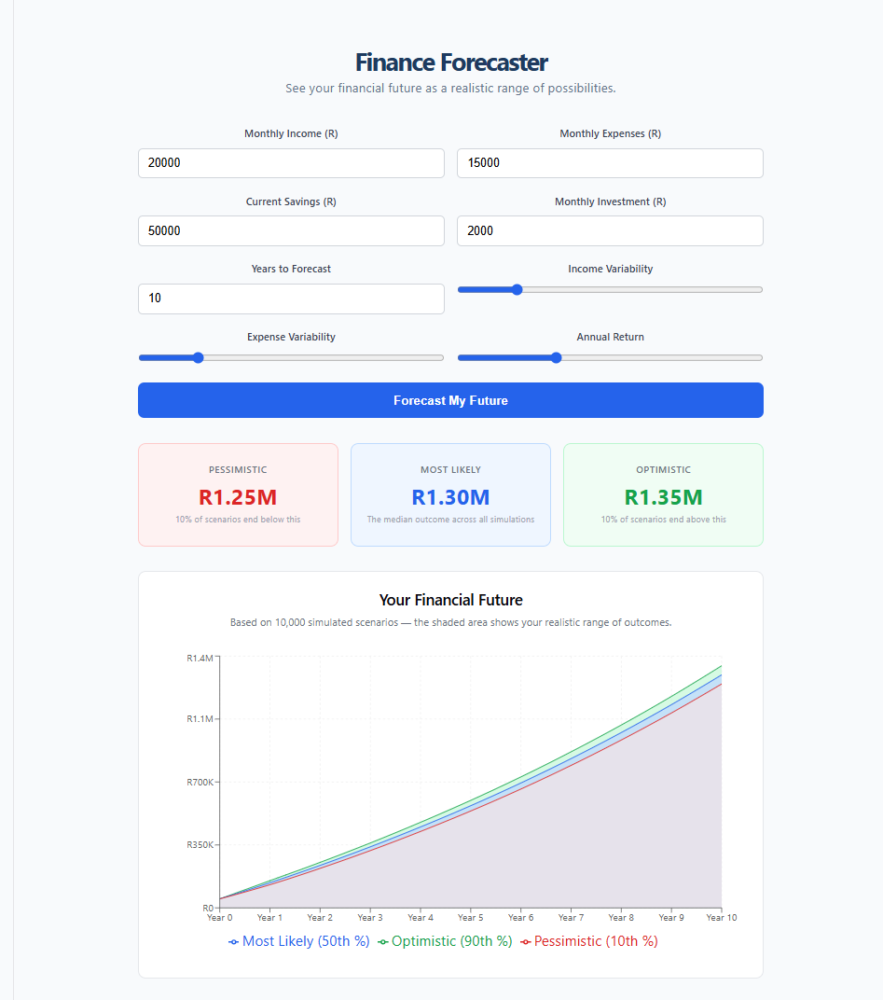

# Finance Forecaster

A personal finance forecasting tool that uses Monte Carlo simulation to show your financial future as a realistic range of possibilities — not a single optimistic line, but pessimistic, likely, and optimistic outcomes based on 10,000 simulated scenarios.

## The Problem

Most financial planning tools give you one answer: "save R500/month and you'll have R200,000 in 10 years." But real life has uncertainty built in — income changes, expenses vary, markets go up and down. A single prediction line is misleading.

This tool runs 10,000 simulated versions of your financial future and shows you the realistic range: best case, worst case, and most likely.

## Demo

## Features

- Monte Carlo simulation engine running 10,000 scenarios
- Fan chart showing 10th, 50th, and 90th percentile outcomes
- Adjustable inputs: income, expenses, savings, investment amount
- Variability sliders for income and expense uncertainty
- Annual return rate adjustment
- Stats panel showing final values for each scenario band
- 7 unit tests covering simulation correctness

## Tech Stack

- Python + NumPy (Monte Carlo simulation engine)
- FastAPI (REST API)
- React + Vite (frontend)
- Recharts (fan chart visualization)

## How It Works

The simulation engine runs 10,000 independent scenarios. Each scenario steps through your finances month by month, applying random variations drawn from a normal distribution to income and expenses. After all simulations complete, the engine calculates the 10th, 50th, and 90th percentile outcomes at each point in time, producing the fan chart.

## Running Locally

Start the backend:

    cd finance-forecaster
    source venv/bin/activate
    uvicorn app.main:app --reload --port 8002

Start the frontend:

    cd frontend
    npm run dev

Open http://localhost:5174 in your browser.

## Running the Tests

    python3 tests/test_engine.py

All 7 tests pass.

Built by Damaris Nteseng - Software Development student, Pretoria, South Africa

